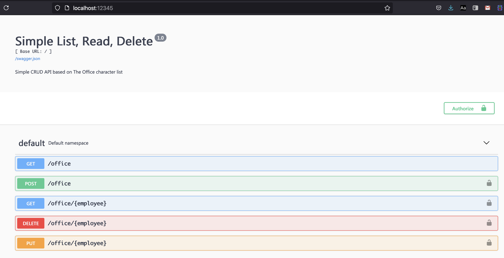

##### OPA setup
1. Download and install opa binary (https://www.openpolicyagent.org/docs/latest/#running-opa)
2. Run opa `opa run -s rego/example.rego -l debug` [url](http://localhost:8181)


##### OPA test-cases
```$ opa test -v rego/
data.example.test_ok: PASS (2.469597ms)
data.example.test_get_same_user: PASS (1.15647ms)
data.example.test_del_same_user: PASS (165.701µs)
data.example.test_del_manager: PASS (218.433µs)
data.example.test_path_wrong_user: PASS (118.561µs)
data.example.test_root_no_user: PASS (105.119µs)
data.example.test_root_user: PASS (91.836µs)
--------------------------------------------------------------------------------
PASS: 7/7
```


##### Data for testing
- Under `data.json`


##### Run the server
- Install dependencies (`requirements.txt`)
- `$ python app.py` [swagger url](http://localhost:12345)
- port: `12345`


##### Run the server with Docker
If you would like to keep your computer clean and not install OPA or any Python dependencies on it, you can use Docker. The Dockerfile in this project repository builds a Docker container with both OPA and flask-opa in it. The defined target architecture is ARM64, but can be swapped by changing the OPA download instructions in the Dockerfile. 

- docker build -t flask-opa .
- docker run -ti -p 127.0.0.1:12345:12345 flask-opa

This will show the logs for both OPA and flask-opa, scrolling on your console.


##### About the authorization
- Anybody can query `/office` (to list all employees)
- All other paths require an authorization header `Authorization: <emp-id>`
- `mike` is the manager. He can add/delete other employees (not `toby`)
- Any employee can view/update his/her information `/office/<emp-id>`


##### Testing

